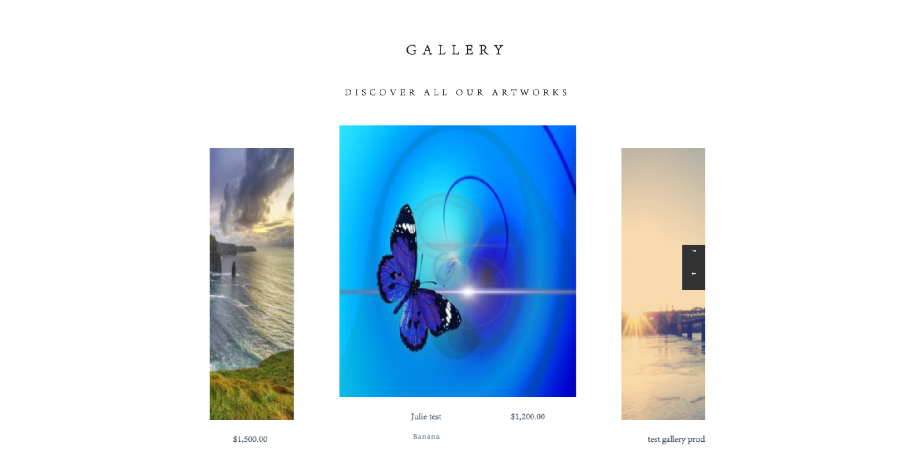

Mangento v2 Art Theme
==============================================

This theme was developed in magento v2.1.0 and for art shop.

Responsive by mobile, tablet and desktop.

Also, used <a href="https://www.webrotate360.com/" >Interactive 3D CAD & 360 Product</a>.
 
 

!
 
!
 
 
-Product detail page
 

 
 
New to Magento? Need some help?
------------------------------------
* If you're not sure about the following, you probably need a little help before you start installing the Magento software: 
* Is the Magento software installed already? 
* What's a terminal, command prompt, or Secure Shell (ssh)? 
* Where's my Magento server and how do I access it? 
* What's PHP? 
* What's Apache? 
* What's MySQL? 

Requirements:
----------------------------------
Apache Server version : 2.2 
Database Server version: 5.6.38  
PHP version: 5.6.30 
PHP extension: mysqli, curl, mbstring 

Panels
--------------------------------
Enjoy your new panels! 

Web server: <a href="http://localhost/" /> 

PHPMyAdmin: <a href="http://localhost:8080" /> 

Local emails: <a href="http://localhost:8025" /> 

License
-----------------------------------
MIT © 2017 Rafael Corrêa Gomes and contributors. 